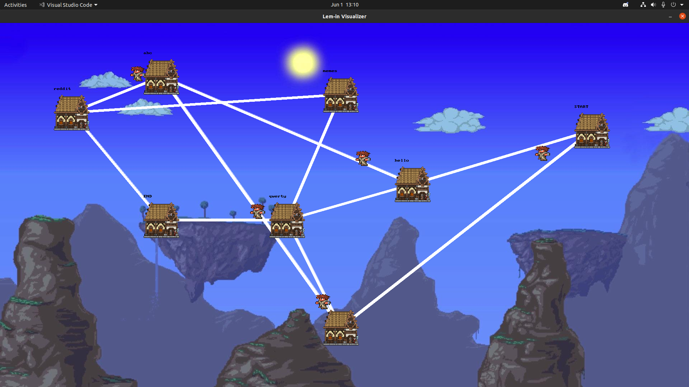

## LEM-IN:

Group project completed at WeThinkCode by:
1. BWEBB: https://github.com/bentenjamin
1. MAGERBER: https://github.com/MattGerber
1. RBOLTON: https://github.com/rachel-e-bolton

The lem-in programme reads information from a file for a given "ant farm", constructs the farm and pushes the ants through the farm optimally.
The "ant farm" is defined by a series of rooms connected to one another by links which ultimately form paths between a `start` and `end` room.   
The file also indicates a number of ants that must move from the start to the end; one ant per room at any given time.

The objective of the programme is to find the paths that allow the ants to move from start to end in the least number of moves, and to allocate the ants accordingly.

To achieve this a Breadth First Search has been implented which searches the map and returns all the paths to the end room starting from the shortest path.
Allocating ants to paths is done by comparing the move cost of each path so that the optimal move cost can be calculated.

## Running Lem-in:

1. Clone the repo with `https://github.com/bentenjamin/damlemon.git` - read the section __**Using Libft after a fresh clone** if you're unfamiliar with initiliasing submodules.
1. Run `make` at the root of the repository to compile `libft` and then `lem-in`.
1. To run `lem-in` redirect a text file to the `lem-in` executable: `$ ./lem-in < testfile.map`.

There is a directory `maps` which contains test files for use with the `lem-in` executable.  
Credit to https://github.com/gwasserfall && https://github.com/Ayano2000 for map files

If `libft` is made, `make lem-in-time` can also be run.  
The executable `lem-in-time` is used in the same manner as `lem-in` but displays the time taken by the programme if it runs to completion (ie. no errors found).  
Use: `$ ./lem-in-time < testfile.map`  
Output:

    ...

    [Real time elpased: 0 seconds]
    [CPU time elapsed: 0.043590 seconds]

## Using Libft after a fresh clone:

On the initial clone, the Libft directory will be empty.

To initialise the directory run `git submodule init` followed by `git submodule update` to get the data for the appropriate commit for the current branch in the parent project.

If during the course of work, the submodule is updated and you would like the updated data on your branch, run `git submodule update --remote Libft`.

## Running Lem-in with Visualiser:

Before making the visualiser, ensure that the correct SDL libs are installed:
- Linux:

      sudo apt-get install libsdl2-dev libsdl2-image-dev libsdl2-gfx-dev libsdl2-ttf-dev

- MacOS:

      brew install SDL2 SDL2_gfx SDL2_image SDL2_ttf

If Homebrew is not installed this can be done with the following command:

    /usr/bin/ruby -e "$(curl -fsSL https://raw.githubusercontent.com/Homebrew/install/master/install)"

Terminal will need to be restarted after the install.
    
To use the visualiser:

1. Run `make visualiser` at the root of the repo.
1. Run lem-in as described in the previous section and pipe the output to the visualiser: `$ ./lem-in < testfile.map | ./visualiser`
1. Use the visualiser commands to run through the visualisation.

Visualiser keyboard commands:
- "n" - Next
- "r" - Reset
- "q" - Quit

## Output Formats:

    pdf2_1 correct output
    L1-1 L2-2
    L1-4 L3-1 L2-3
    L3-4 L2-4
    
    viz correct output
    L1-3 L2-2
    L1-4 L2-5 L3-3 L4-2
    L1-end L2-6 L3-4 L4-5 L5-3
    L2-end L3-end L4-6 L5-4
    L4-end L5-end